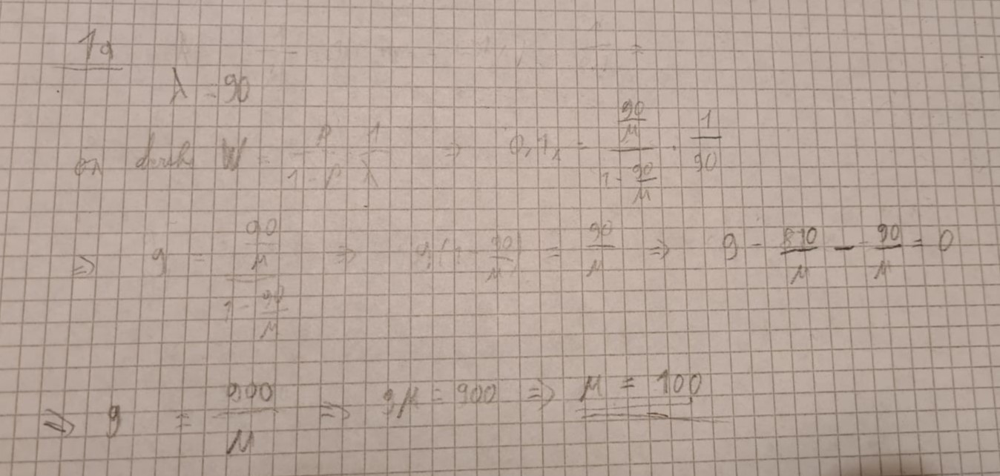
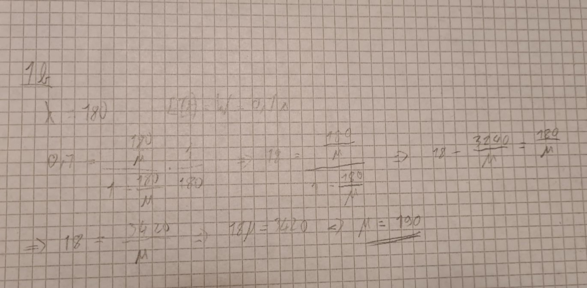
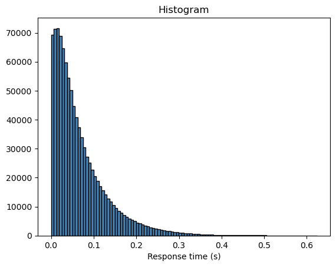
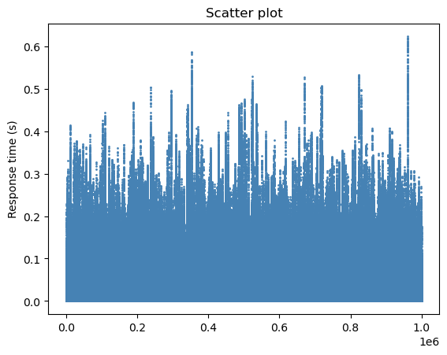
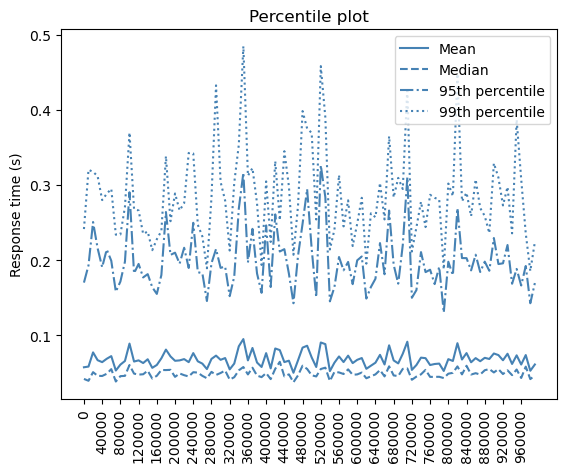
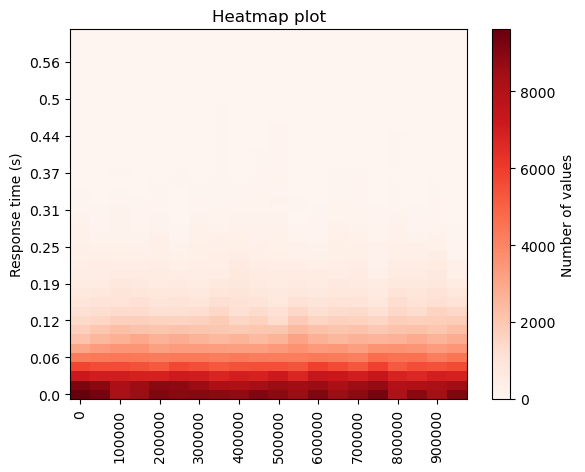

Lab report: capacity planning and performance analysis with SimPy
========================================================================

> [!NOTE]
> Write your report in this document. You can write it in English or French

> [!IMPORTANT] 
> All the answers to the questions are in this document, the rest is in the Jupyter Notebook. Also i did not create new files like `simpy_batch.py` mentioned in the lab because all the code part of this lab is in the Notebook.

Result table
------------

This table documents the results of the different simulation scenarios

| Case                                                   | Required service rate| Mean service time | Response time      |
|--------------------------------------------------------|----------------------|-------------------|--------------------|
| 1a. Base scenario: $\lambda = 90/s$                    | $\mu = 100 /s$       | $1/\mu$ = 10 ms   | mean: 100 ms       |
| 1b. M/M/1 model for $\lambda = 180/s$                  | $\mu = 190    /s$       | $1/\mu$ =  5.263    ms | mean: 100 ms       |
| 2a. Batch arrivals with $\lambda_\text{web} = 90$/s    | $\mu =  127   /s$       | $1/\mu$ =   7.874   ms | mean: 100 ms       |
| 2b. Batch arrivals with $\lambda_\text{web} = 180$/s   | $\mu =  217   /s$       | $1/\mu$ =  4.608    ms | mean: 100 ms       |
| 3a. Batch arrivals with $\lambda_\text{web} = 90$/s    | $\mu =  143   /s$       | $1/\mu$ =   7   ms | 99th perc.: 300 ms |
| 3b. Batch arrivals with $\lambda_\text{web} = 180$/s   | $\mu =  234   /s$       | $1/\mu$ =  4.274    ms | 99th perc.: 300 ms |

Case 1a: Base scenario
----------------------

Scenario

- M/M/1 model
- $\lambda = 90$ requests per second
- Target response time $E[t] = 100$ ms

Use the analytical model to compute required service rate $\mu$. Report the value in the table on top.

> The values where already in the table but here's the calculation:

Case 1b: Doubling the arrival rate
----------------------------------

Use the same scenario as in Case 1a, but double the arrival rate $\lambda$.

Use the analytical model to compute the required service rate $\mu$. Report it in the table on top.

> Here's the calculation for 1b using the analytical model:

**Question**: does the service rate need to double, too? Interpret the result.

> No, the service rate doesn't need to double. Doubling 𝜆 to 180 increases the demand on the system, but to maintain the same response time, you only need enough extra capacity to keep 𝜇 - 𝜆 at the same level (100 - 90 = 10). Doubling μ would create unnecessary surplus capacity, reducing the response time far below 100ms. So to keep the level at 10 when 𝜆 is 180, 𝜇 needs to be 190 because 190 - 180 = 10

Case 2a: Batch arrivals
-----------------------

Simulate the model with batch arrivals and an arrival rate of Web pages (not file requests) of $\lambda = 90$ web requests per second.

Which service rate is required to achieve a mean response time of $E[t] = 100$ ms. Report this result in the table on top.

**Question**: interpret this result!
> We have to increase the service rate to 127/s to maintain a mean response time of 100ms.

> In the batch arrival case, each web page request generates a random number of file downloads (between 1 and 9). This batch processing introduces higher variability in the arrival pattern, increasing the likelihood of larger queues and longer delays. To maintain the same mean response time (E[t]=100ms) under batch arrivals, the system must compensate for larger queuing effects by increasing its service capacity. This reflects how real-world systems often need more resources to handle bursty traffic patterns compared to evenly distributed arrivals. 

> In practical terms, the system's performance degrades under bursty traffic unless additional capacity is provisioned, as observed here with 𝜇 increasing from 100 to 127.

Case 2b: Batch arrivals and double arrival rate
-----------------------------------------------

Determine the service rate $\mu$ that is required if the arrival rate of Web pages doubles and we want to achieve a response time of 100 ms.

Report this result in the table on top. Interpret the result.

> We have to increase the service rate to 217/s to maintain a mean response time of 100ms. The value 217 was calculated by knowing that 𝜇 - 𝜆 should be equal to 37 (because in 2a 127 - 90 = 37).

> In the base scenario, μ−λ=10 was sufficient to achieve E[t]=100ms. However, with batch arrivals, a larger surplus μ−λ=37 is required due to higher variability and queuing effects. When λ doubles, μ increases proportionally to maintain this surplus, ensuring consistent response times despite increased traffic.

> We can see that 𝜇 - 𝜆 still holds in the "real world" scenario with bursts of traffic. The only difference with the base scenario is that we need a larger surplus.

Case 3a: Batch arrivals and 99th percentile
-------------------------------------------

Determine the service rate $\mu$ that is required such that the 99th percentile of the response time is around 300 ms.

Report this result in the table on top. Interpret the result.

> The service rate $\mu$ must be set to 143/s to achieve a 99th percentile response time of 300 ms.

> The increase in μ from 127 (for E[t]=100ms) to 143 (for the 99th percentile target of 300 ms) reflects the need to handle worst-case delays caused by batch arrivals. While the mean response time in section 2 depends on the average system behavior, the 99th percentile accounts for the "tail" of the response time distribution, requiring higher service capacity to reduce the impact of rare but significant queuing delays. This ensures acceptable performance for almost all users, not just on average. That's why, for web pages at least, we mainly need to focus on the 99th percentile and not on the mean response time.

Case 3b: Batch arrivals, double arrival rate and 99th percentile
----------------------------------------------------------------

Determine the service rate $\mu$ that is required if the arrival rate of Web pages doubles such that the 99th percentile of the response time is around 300 ms.

Report this result in the table on top.

> The service rate $\mu$ must be set to 234/s to achieve a 99th percentile response time of 300 ms.

Visualization
-------------

Use the plot functions defined in the file `visualization/plots.py` to visualize the response time distribution for the case 3b (Batch arrivals, double arrival rate and 99th percentile).

Include each plot in this report and interpret the results.

> - The histogram shows the frequency distribution of response times.
>- It exhibits a long tail, with most response times concentrated under 100 ms but tapering off towards higher values.
>- This reinforces the need for using the 99th percentile as a metric since the tail represents slow responses that impact user experience.

>- The scatter plot shows individual response times throughout the simulation.
>- The periodic spikes indicate bursts of high response times, likely due to queuing delays caused by bursty traffic patterns.
>- These spikes emphasize the system’s variability and the importance of maintaining a sufficient service rate (here μ=234) to keep the 99th percentile response time at the desired 300 ms.
>- We also see the limitation of a scatter plot here because most of the response times are lost in this blue ocean of points. 

>- We see 4 different values in this plot: the mean, the median (50th percentile), the 95th percentile and the 99th percentile.
>- The 99th percentile is the value that 99% of the data is below. It's the most important value here because it represents the worst-case response time that users might experience.
> - We can see/guess the 300ms target for the 99th percentile we set in case 3 by visually trying to do a linear regression of the 99th percentile values. The resulting line would be traced approximately near the 0.3 value. 

>- The heatmap visualizes the distribution of response times across the simulation.
>- The darker regions near the bottom indicate that most response times cluster around lower values (under 100 ms), while lighter areas at higher response times show fewer occurrences.
>- This indicates that while a significant majority of requests have low response times, some experience higher delays, which the 99th percentile accounts for.
>- There is no red spikes in the heatmap, which means that even with bursts the traffic is still "normal". Normal in the sense that if we saw this graph in a monitoring tool of a real website it would tell us that the website is working correctly.

Conclusion
----------

Document your conclusions here. What did you learn from the simulation results?

> This lab provided valuable insights into capacity planning for a simple web system with one server. 

> We firstly learned that doubling the arrival rate doesn't require doubling the service rate - instead, maintaining the correct difference (μ-λ) is key for stable performance. 

>The introduction of batch arrivals revealed how real-world traffic patterns require higher service rates than theoretical models suggest, due to increased variability and queuing effects. Most importantly, we discovered that designing for mean response times isn't sufficient for user satisfaction - targeting the 99th percentile provides a more reliable measure of actual user experience. 

>Finally, the visualizations, particularly the heatmap and percentile plots, showed us in a visual way how response times distribute over time in a simple M/1/1 system with batch arrivals. 

